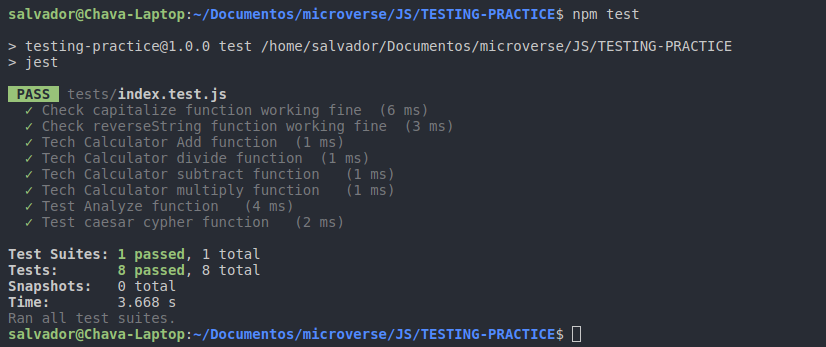

# TESTING-PRACTICE

A Simple Excersie to test different functions JavaScript and Jest.

[Click To Check The Project Details](https://www.theodinproject.com/courses/javascript/lessons/testing-practice)

## Authors

This project was executed by the duo of :

- [Mohamed Naser](https://www.linkedin.com/in/mohamednaseramein/)
- [Salvador Olvera](https://www.linkedin.com/in/salvador-olvera-n)

## Used Tools

- JavaScript
- Jest

## Work Done

- [x] Test capitalize(string).
- [X] Test reverseString(string).
- [X] Test Calculator (add, subtract, divide, and multiply.).
- [X] Test caesar() cypher. 
- [X] Test Array Analysis.


## Setup

Open your git bash and cd to the location you'd like to put your files the run the command below.

```console
git clone https://github.com/mohamednaser/TESTING-PRACTICE.git
```

## Testing

#### Get the dependencies needed for the game

`$ npm install`

#### Then run the test

`$ npm test`


## ScreenShots



